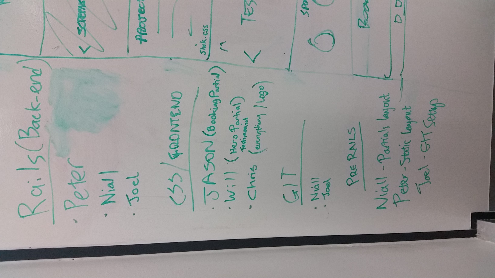
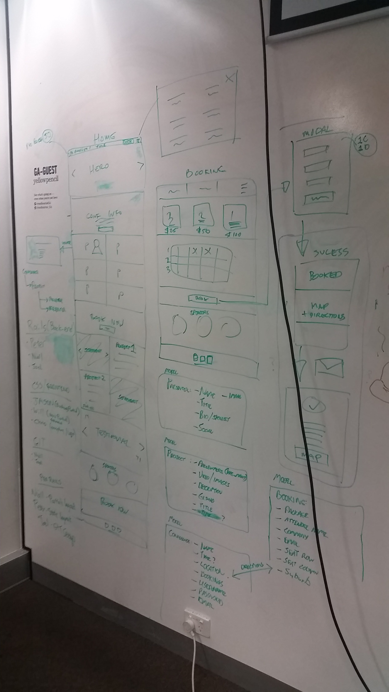
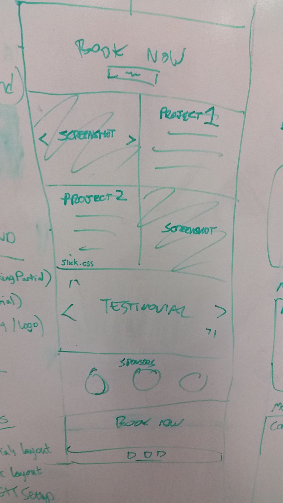
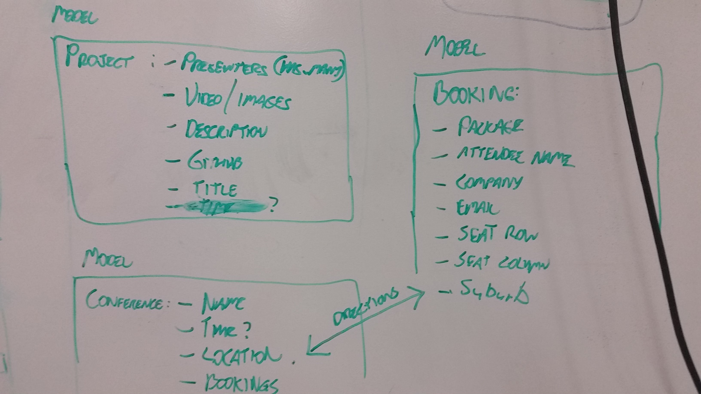
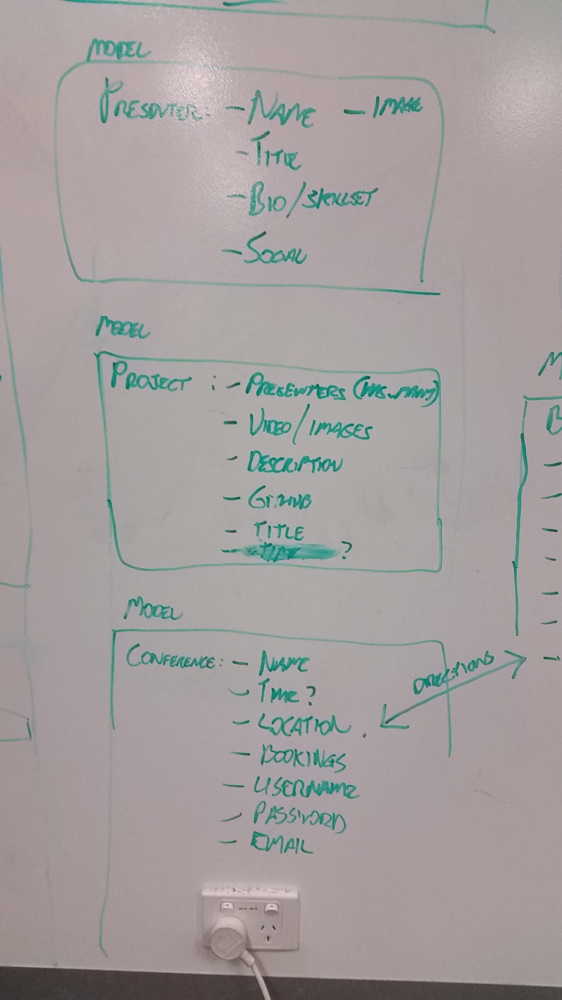
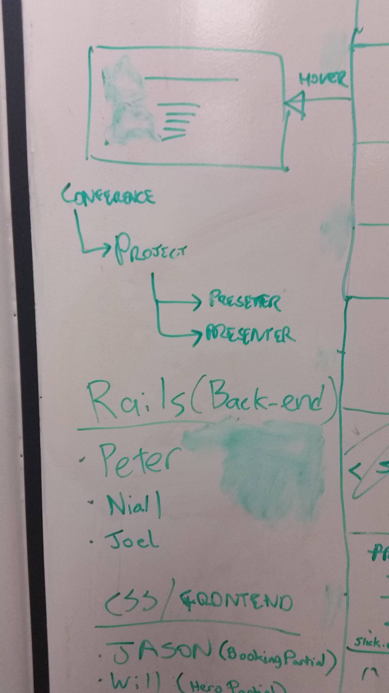
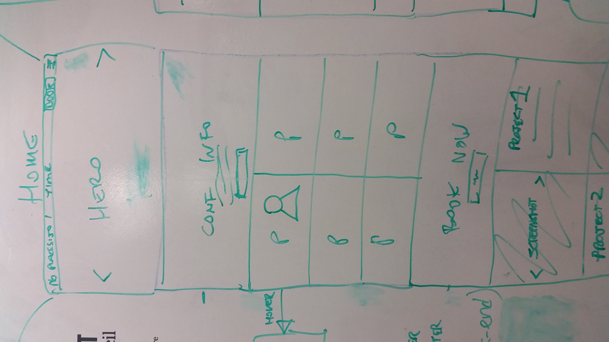
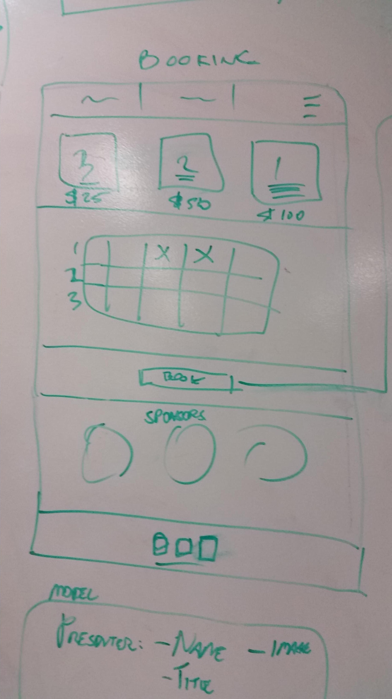
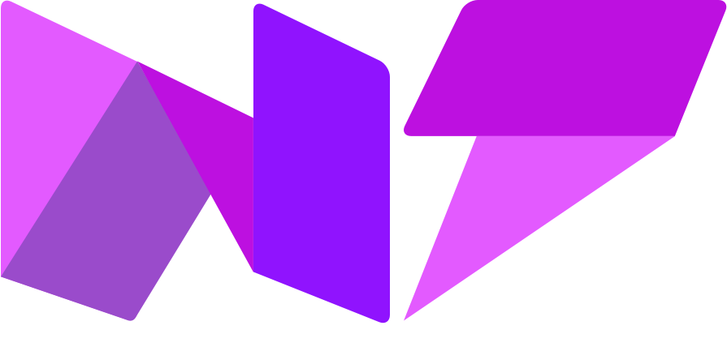

j WDIConf 2016

## Workload
### Pre rails (Partials and Static Layout).
- Divided up sections for the hero, information, booking, project sections and a booking page.
- Layout done in Balsamiq.

### Git control
- Decided on having a gitlord with forked projects that would send pull requests to minimize merge problems.
- Added rails project.
- Added partials.
- Fixed up gitignore.

### Rails, database and backend
- Added presenter models, routes and database.
- Added date information to the databse.
  - We added a countdown timer to the event from a date set in the database
```
puts Time.new(2016, 07, 17, 10, 0, 0, "+10:00")
```
- Added gem annotate.
```
Annotates Rails/ActiveRecord Models, routes, fixtures, and others based on the database schema.
```
- Project time examples from [Stack overflow](http://stackoverflow.com/questions/5474164/rails-seeding-database-data-and-date-formats).

```
startDate  => DateTime.new(2009,9,1,17)
```
- For the countdown timer we used [Countdown.js](http://countdownjs.org/).
- Used [this reference](https://developer.mozilla.org/en-US/docs/Web/JavaScript/Reference/Global_Objects/Date/parse) to parse a string into a date object.

### Google Maps integration
- Created a hardcoded address map with google maps from [google developers documentation](https://developers.google.com/maps/documentation/distance-matrix/intro#DistanceMatrixResponses).
- Wanted to remove the [map navigation elements](https://developers.google.com/maps/documentation/javascript/examples/control-disableUI).

### CSS Frontend
- Added a carousel at the top of the page to display different parts of each project.
- Added hero css.
- First version wifreframes done up in bootstrap.
- Used css keyframes to make neon heading
- Decided to change the sponsors icons to load from grayscale initially to colored on mouse hover.
- Changed using wider logos with text (different width too) to just using squared logos.
- Added some images from [here](https://www.behance.net/laylow) to link with the synthwave/synthpop/cyberpunk theme.
- Added [https://codepen.io/simeydotme/pen/jgcvi](glitter) style overlay to player image profiles because glitter is awesome.
- Added a [http://codepen.io/SitePoint/pen/MwNPVq](javascript countdown clock) in the navbar partial.

### Layouts
- Opted for a single page layout (minus the booking page) with a static header.
- Divided the index page into partials and divvied up the front end to a few members.

### Resources
- Took profile pictures, resized, compressed and converted to black and white.
- First logo done in Sketch.

### Technologies
- Rails
- Javascript
- CSS

### Resources
- Added profile pictures.
- Added project carousels with profile overlays.


### Whiteboard brainstorming











## Seed brainstorming
- Had the presenters as arrays initially then changed them to objects.
- Thought about changing the presenter_skills to seperate objects later if we have time.

## Branding brainstorming

